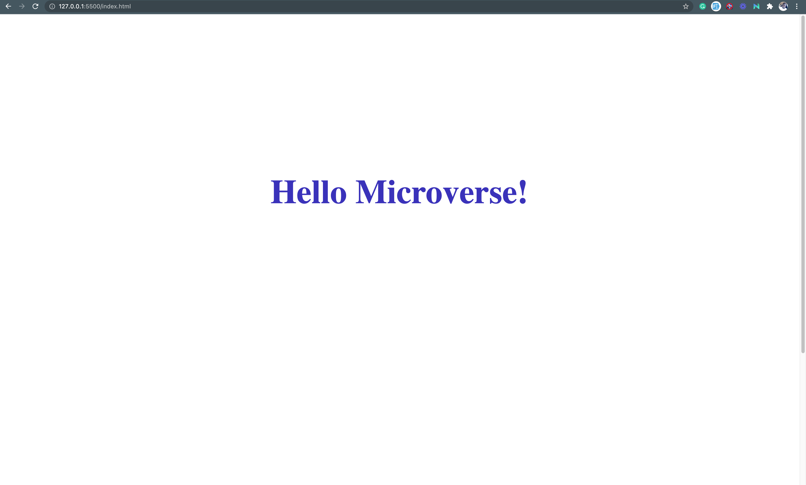

# Hello World

> My first project review code for microverse.

No features, just a simple project to test my skills.

## Built With

- HTML and CSS.
- No Frameworks
- Git and VsCode.

## Getting Started

To get a local copy up and running follow these simple example steps.

### Prerequisites
- A browser
- Text Editor or IDE

### Setup
 - copy the git link for cloning.

### Install
 - Open terminal
 - run git clone (link)

### Usage
- double click on the html file to open in browser.

## Authors

👤 **Billions Atugonza joel**

- GitHub: [@githubhandle](https://github.com/billionsjoel)
- Twitter: [@twitterhandle](https://twitter.com/BillionsJoel)
- LinkedIn: [LinkedIn](https://www.linkedin.com/in/billionsjoel/)

## 🤝 Contributing

Contributions, issues, and feature requests are welcome!

Feel free to check the [issues page](../../issues/).

## Show your support

Give a ⭐️ if you like this project!

## Acknowledgments

- Hat tip to anyone whose code was used
- Inspiration
- etc

## 📝 License

This project is [MIT](./MIT.md) licensed.
